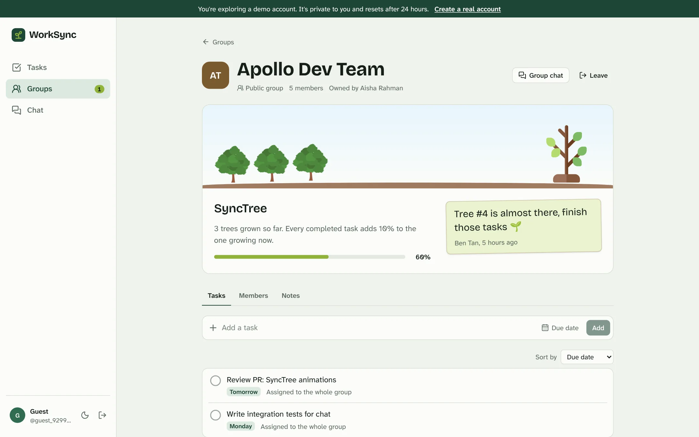
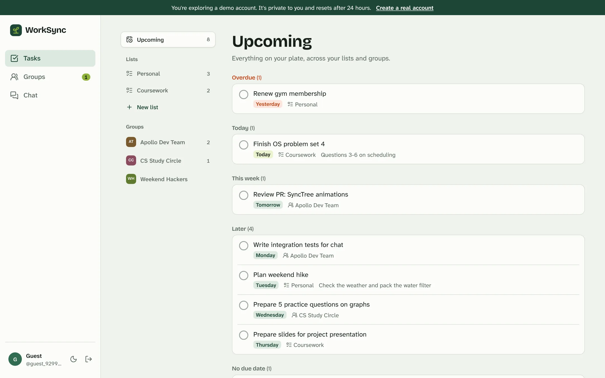
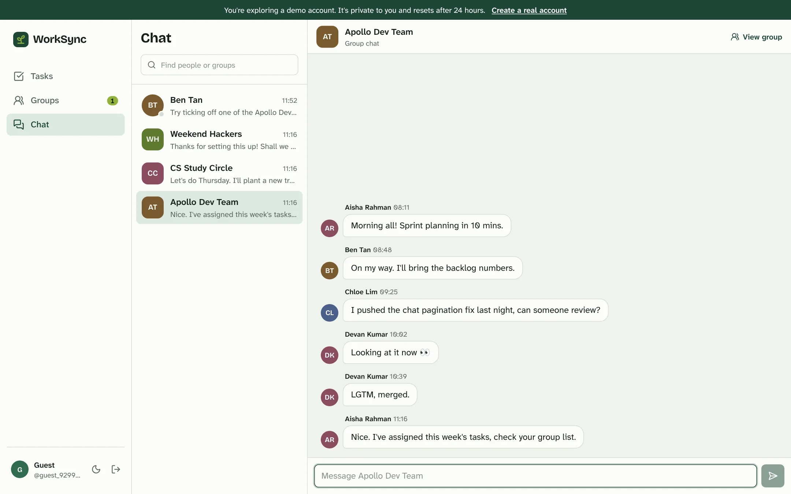
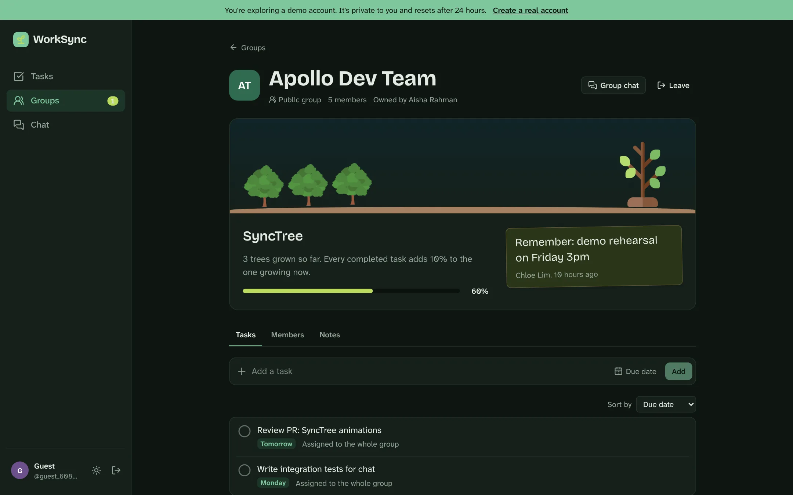
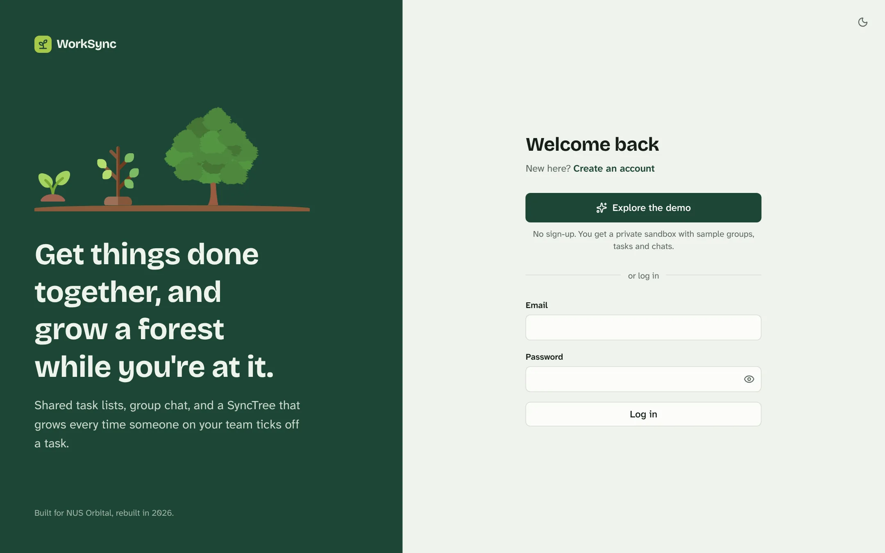
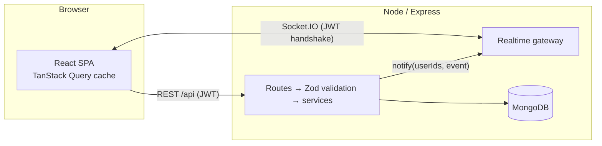

<div align="center">


# WorkSync

Shared task lists, real-time group chat, and a **SyncTree** that grows every time someone on your team finishes a task.

[](https://github.com/george-yeo/WorkSync-Orbital/actions/workflows/ci.yml)


**[Live demo](https://worksync.vercel.app)**: click _Explore the demo_ to get a private sandbox account, no sign-up needed.



</div>

## About

WorkSync started as our NUS Orbital project (2024, Team 165 Titans). In 2026 it was rebuilt end to end: a TypeScript rewrite of the API with a proper security model, a new React front end, automated tests, and a free-tier deployment that stays up.

The idea is simple: productivity is easier when it's shared and visible. Every group gets a SyncTree. Each task a member completes adds to the tree's growth, finished trees stay in the group's forest, and the forest becomes a running record of what the team has done together.

## Features

**Tasks**

- Personal lists, plus your tasks in each group, with notes and due dates
- An _Upcoming_ view across everything, grouped into overdue, today, this week and later
- Instant check-off (optimistic updates), sorting, and a collapsible completed section

**Groups**

- Public groups people can find and ask to join, or private invite-only groups
- Owners invite people, approve or decline join requests, remove members, rename the group, change its picture or delete it
- Owners can assign a task to every member at once; each member completes their own copy
- A notes wall; recent notes rotate on a sign beside the SyncTree

**SyncTree**

- Any member can plant a tree; every completed group task grows it by 10%, and un-ticking a task takes the growth back
- Finished trees join the group's forest

**Chat**

- Direct messages and a chat per group, delivered in real time over WebSockets
- Online presence, unread indicators and paginated history
- Search for people and groups; non-members of a public group can ask to join from the chat

**Everything else**

- Profile pictures (re-encoded server-side), editable display name, username and email, password change, account deletion
- Light and dark themes that follow your system setting, with a manual override
- Responsive layout down to phone widths, keyboard accessible, respects reduced-motion
- **Demo mode**: one click creates a private, pre-populated sandbox that's deleted after 24 hours

<table>
  <tr>
    <td></td>
    <td></td>
  </tr>
  <tr>
    <td></td>
    <td></td>
  </tr>
</table>

## Tech stack

|              |                                                                                                            |
| ------------ | ---------------------------------------------------------------------------------------------------------- |
| **Client**   | React 19, TypeScript, Vite, Tailwind CSS v4, React Router, TanStack Query, Socket.IO client                |
| **Server**   | Node 22, Express 5, TypeScript, Mongoose 9, Socket.IO, Zod, sharp, pino                                    |
| **Database** | MongoDB (Atlas)                                                                                            |
| **Testing**  | Vitest + Supertest integration tests against a real MongoDB (in-memory locally, a service container in CI) |
| **Hosting**  | Vercel (client), Northflank (API, Docker), MongoDB Atlas; all on free tiers                                |

## Architecture



- **Layered server.** Each feature module (`auth`, `me`, `users`, `lists`, `tasks`, `groups`, `chat`, `demo`) has routes that only parse input and call a service, services that hold the business rules and access checks, and DTO mappers that decide exactly which fields leave the server.
- **Realtime as a side effect.** Services call a small `realtime.toUsers(...)` notifier instead of importing Socket.IO, so the domain logic is transport-agnostic and testable. The client turns events into cache updates or query invalidations.
- **Access control in one place.** Group operations go through `loadAsMember` / `loadAsOwner`; everything else is scoped by the authenticated user's id in the query itself.

### Security

The 2026 rebuild came out of an audit of the original code. What's in place now:

- Every route that touches user data requires a valid JWT, and every query is scoped to the caller (no IDOR); request bodies are validated with strict Zod schemas (no mass assignment)
- Socket connections authenticate with the same JWT; the server decides which room you join
- Passwords hashed with scrypt; login returns one generic error and runs in constant time whether or not the email exists
- Rate limiting on auth, demo sessions and the API overall; Helmet headers; CORS locked to the client origin
- User input in searches is escaped before it reaches a regex (no ReDoS / regex injection)
- Uploaded images are decoded and re-encoded with sharp, so non-images are rejected regardless of their declared type
- Malformed input gets a 400, never an unhandled rejection that takes the process down
- Demo guests are sandboxed: they can't see or message real users, and nothing they write is visible to anyone else

## Getting started

**Prerequisites:** Node 22+ and a MongoDB instance (local `mongod`, Docker, or a free Atlas cluster).

```bash
git clone https://github.com/george-yeo/WorkSync-Orbital.git
cd WorkSync-Orbital
npm install

cp server/.env.example server/.env   # set MONGO_URI and JWT_SECRET
npm run dev                          # API on :4000, client on http://localhost:5173
```

In development the Vite dev server proxies `/api` and `/socket.io` to the API, so the client needs no configuration. With `DEMO_ENABLED=true` you can click _Explore the demo_ straight away.

| Script (run from the root)           |                                                                 |
| ------------------------------------ | --------------------------------------------------------------- |
| `npm run dev`                        | API and client with hot reload                                  |
| `npm test`                           | Server integration tests (starts an in-memory MongoDB)          |
| `npm run lint` / `npm run typecheck` | ESLint and TypeScript for both workspaces                       |
| `npm run build`                      | Production builds of both workspaces                            |
| `npm run seed`                       | Create the demo seed users (also happens automatically on boot) |

### Project structure

```
.
├── client/                 React app (Vite)
│   ├── public/             favicon, SyncTree artwork
│   └── src/
│       ├── auth/           session + current user
│       ├── realtime/       Socket.IO provider (presence, unread, cache updates)
│       ├── lib/            API client, query hooks, types, formatting
│       ├── components/     app shell and UI primitives (dialog, toast, avatar…)
│       └── features/       auth, tasks, groups, chat, profile
├── server/                 Express API
│   ├── src/
│   │   ├── config/         validated environment
│   │   ├── models/         Mongoose schemas
│   │   ├── middleware/     auth, validation, errors, rate limits, uploads
│   │   ├── modules/        one folder per feature: routes, services, DTOs
│   │   └── realtime/       Socket.IO gateway + notifier seam
│   ├── test/               integration tests
│   └── Dockerfile
├── docs/                   deployment guide, screenshots
└── .github/workflows/      CI
```

## Deployment

See **[docs/DEPLOYMENT.md](docs/DEPLOYMENT.md)** for step-by-step setup of MongoDB Atlas, the API on Northflank and the client on Vercel.

## Roadmap

- Decorating SyncTrees to celebrate milestones
- Hierarchical groups, where leaders can see and manage their members' tasks

## Credits

Built by **Yeo Bing Teck, George** and **Soo Yi Tao** (Team 165 Titans) for NUS Orbital 2024. Rebuilt by George in 2026.

SyncTree illustrations designed by [Freepik](https://www.freepik.com).

The [original 2024 demo video](https://drive.google.com/file/d/14YyIyPeEQrTIfzRLdeYuVXCvg3pCezYe/view) shows the first version of the app.
